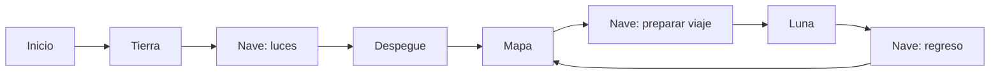

# Misión Cohete · aventura por el Sistema Solar

Juego de lectura en español para segundo grado con Phaser 3, TypeScript y Vite. Conserva la base terrestre original con sus físicas, tutorial y seis misiones. Agrega una nave reutilizable, un mapa de campaña y un nivel lunar. Sin backend, cuentas, analítica, servicios de IA, tienda ni assets externos.

## Ejecutar

Node.js 18.18 o posterior; recomendado Node.js 22 LTS.

```sh
npm install
npm run dev
```

Abrir **http://localhost:5173**. Vite escucha en `0.0.0.0:5173`: desde otro equipo de la misma red usar `http://IP-DE-ESTA-COMPUTADORA:5173`. El puerto debe estar permitido por el firewall. Si un servidor viejo está abierto, detenerlo con Ctrl+C antes de iniciar otro. `localhost`, `127.0.0.1` y cada IP tienen guardados separados: usar siempre la misma dirección para continuar una partida.

```sh
npm run typecheck
npm run lint
npm test
npm run build
npm run preview
```

Build genera `dist/`; preview muestra ese build en el puerto anunciado por Vite (habitualmente 4173). Los sprites originales se generan en el proyecto con formas y gráficos de Phaser. El único aviso de build esperado es el tamaño del bundle de Phaser.

## Jugar

| Tecla | Acción |
| --- | --- |
| ← / → | Caminar; elegir mundo en el mapa |
| S | Saltar |
| A | Agarrar, usar, instalar, sentarse |
| Enter | Confirmar, seguir tras celebración o viajar |
| Escape | Pausa; volver al inicio desde el mapa |
| H | Ayuda |

La base mantiene su tutorial obligatorio: caminar, saltar e interactuar con la caja. Luego hay exactamente seis instrucciones principales: caja roja, llave, puerta azul, tres baterías, llevar motor e instalarlo/activar botón verde.

La campaña sigue este recorrido:

1. Completar Tierra y reparar el cohete.
2. Entrar en la nave, encender las luces y confirmar el despegue.
3. Ver la celebración y el mapa del Sistema Solar.
4. Elegir Luna: recoger tarjeta azul, ponerla en la consola, presionar el botón verde; ir al asiento, sentarse con A y confirmar con Enter.
5. Viaje corto, luego cinco misiones lunares con gravedad menor.
6. Celebración lunar, regreso a la nave y una tarea corta de luces.
7. Regresar al mapa con Tierra y Luna completadas.

En la Luna: encontrar la roca grande con A, saltar sobre ella, recoger la batería debajo de la plataforma, entregarla al vehículo y subir a la plataforma de arriba. Se puede llegar a la plataforma alta saltando desde cualquiera de las plataformas bajas. No hay daño, penalizaciones ni tiempo límite.

La nave muestra **una sola instrucción por paso**. Una tarea correcta avanza al siguiente paso; completar una micro-misión muestra su celebración y requiere Enter para continuar. La primera ayuda ofrece una pista y resalta palabras; la segunda y posteriores leen la instrucción usando SpeechService. El mute también silencia esa lectura. H conserva el comportamiento visual original en Tierra.

Los viajes tienen entre una y dos micro-misiones, elegidas mediante planes configurados y deterministas. La primera ida utiliza tarjeta y asiento. Las siguientes idas alternan batería, cable rojo y luces, siempre seguidas del asiento. Los regresos alternan luces, cable y batería. Hay **cinco micro-misiones funcionales**; oxígeno, navegación y combustible están definidos para expansión pero no se seleccionan todavía. La variante de batería “debajo de la consola” se usa si se registró ayuda con la palabra “debajo”; no se generan instrucciones con IA.

## Mapa y progresión

Se ven Tierra, Luna, Mercurio, Venus, Marte, Cinturón de Asteroides, Júpiter, Saturno, Urano, Neptuno y Sol, además de un mundo secreto bloqueado. Cada destino muestra Completado, Disponible o Bloqueado. La ruta es educativa, no astronómicamente exacta.

Solo Tierra y Luna son jugables en esta fase. Tierra desbloquea Luna. El siguiente requisito configurado tras Luna es **Mercurio**, pero se mantiene bloqueado por `implemented: false`, igual que todos los mundos futuros. Marte no se desbloquea. Los destinos completados se pueden repetir sin borrar el historial.

Las recompensas son configurables en `src/data/worlds.ts`:

- Misión principal: +1 estrella.
- Micro-misión de nave completa: +1 estrella (no por cada paso).
- Nivel completo: +10 monedas.

Un recorrido nuevo completo Tierra → Luna → regreso produce **15 estrellas y 20 monedas**: Tierra 6, luces iniciales 1, tarjeta/asiento 2, Luna 5, luces de regreso 1. Repetir un nivel o viaje en una sesión nueva puede dar nuevas recompensas. Reintentar un evento o recargar la misma sesión no duplica recompensas gracias a identificadores de entrega persistentes. No hay tienda.

## Nombre, voz y sonido

Valores fijos en `src/data/player.ts`:

```ts
PLAYER_DISPLAY_NAME = 'FsantigoEV';
PLAYER_SPOKEN_NAME = 'Fran Santiago Fin';
```

El texto visual y hablado son distintos intencionalmente. No se deriva la pronunciación. El servicio reutilizable `SpeechService` usa `speechSynthesis`, cancela la frase anterior, mantiene una frase a la vez y secuencia los mensajes finales. Volumen 0.65; velocidad 0.95. Preferencia de voz: es-HN → es-MX → es-ES → es-US → otra española. Se prefieren voces instaladas dentro del idioma elegido. La disponibilidad y pronunciación dependen del navegador/sistema. Si la voz falla, el juego continúa. Referencia: [SpeechSynthesis, MDN](https://developer.mozilla.org/en-US/docs/Web/API/SpeechSynthesis).

El botón de sonido conserva su ajuste y cancela la voz inmediatamente al silenciar. Los efectos de salto, recogida, misión, puerta y lanzamiento usan Web Audio local. No se conecta a APIs externas de voz. En el final terrestre se anuncia que Fran Santiago Fin desbloqueó la Luna; en el lunar se habla de su misión completada allí.

## Guardado y lectura

`ProgressManager` conserva la única clave versionada **`reading-space-game-v1`**, versión 1. No hay botón Guardar: se escribe al cambiar misiones, objetos, recompensas, ayuda, audio iniciado, intentos, niveles, sonido, pausas y salida, además de checkpoints periódicos. Los datos permanecen en el navegador/origen y nunca se envían a un servidor.

La extensión lee el formato anterior de esta misma clave, conserva sus estrellas, monedas, palabras y sesiones, y deriva los mundos completados de los niveles conocidos. También mantiene la migración de `mision-cohete.progress.v1`. No inventa recompensas retroactivas. JSON corrupto inicia un estado válido; checkpoints inválidos se descartan. Si localStorage está bloqueado, se juega en memoria.

Estado principal (campos abreviados):

```ts
{
  version: 1,
  player: { displayName, spokenName, grade: 2, coins, stars },
  progress: {
    currentWorld, currentLevel,
    completedLevels, completedWorlds, unlockedWorlds
  },
  reading: {
    words: { puerta: { seen, independent, helpUsed }, /* ... */ },
    tasks: { /* exposiciones, ayuda, audio, intentos y finalización por paso */ }
  },
  sessions: [/* id, startedAt, endedAt, level, completed,
    missionsCompleted, totalTimeSeconds, helpUsed,
    wrongInteractions, audioUsed, attemptsPerMission */],
  completedShipMissions: [],
  trips: [],
  currentTrip: null,
  checkpoint: null,
  moonCheckpoint: null,
  rewardClaims: [],
  activeSessionId: null,
  scene: 'SolarSystem',
  settings: { muted: false }
}
```

La nave persiste viaje, colección de tareas, micro-misión, paso e inventario. Recargar restaura el paso actual; el explorador vuelve a la entrada de la habitación. Si la tarea ya estaba celebrándose, Enter continúa sin volver a consumir una pieza ni entregar otra recompensa. Una recarga durante el viaje reinicia únicamente la animación corta. Tierra y Luna restauran la última posición segura sobre suelo/plataforma, sin guardar velocidades de un salto.

Continuar recupera la escena activa o muestra el mapa cuando no hay nivel/viaje pendiente. Nueva partida exige confirmación en pantalla; Escape cancela sin borrar. Mantiene el nombre fijo al reiniciar.

Estadísticas educativas:

- `seen`: una exposición por misión/paso y sesión; una recarga no la incrementa.
- `independent`: finalización sin H en esa misión/paso.
- `helpUsed` por palabra: una tarea asistida, aunque H se pulse varias veces.
- Ayuda de sesión: cada pulsación; audio: utterances cuyo evento `start` ocurrió, incluidos feedback y lectura asistida.
- Intentos y errores: interacciones, sin castigos.
- Tiempo activo: excluye pausa y tiempo con la página cerrada.

Se inicializan caja, roja, llave, puerta, azul, batería, motor, cohete y verde; los vocabularios lunares y de nave se incorporan al aparecer. Las asociaciones son explícitas, no una evaluación automática de comprensión oral.

## Arquitectura

- `src/data/worlds.ts`: orden, foco lector, niveles, recompensas y requisitos; marca mundos implementados.
- `src/data/shipMissions.ts`: ocho micro-misiones, pasos, palabras, pistas, variantes y planes de viaje.
- `src/data/lunarMissions.ts`: cinco instrucciones lunares.
- `src/scenes/GameScene.ts`: base terrestre existente y transición a la nave.
- `src/scenes/ShipInteriorScene.ts`: una escena reutilizable para todas las tareas de nave.
- `src/scenes/MoonScene.ts`: exploración, entrega y plataformas lunares.
- `src/scenes/AdventureScene.ts`: controles, pausa, ayuda y UI compartidos de nave/Luna.
- `src/scenes/SolarSystemScene.ts`: mapa y selección de destinos.
- `src/scenes/TravelScene.ts`: transición breve y reanudable.
- `src/scenes/BootScene.ts`, `NameScene.ts`, `WinScene.ts`: assets, inicio/continuidad y celebraciones.
- `src/entities/Player.ts`: movimiento y salto configurable.
- `src/systems/`: reglas originales, progreso, voz y efectos.
- `tests/`: reglas terrestres, voz, persistencia, corrupción, tiempo, lectura, orden de mundos, viajes y recompensas.

## Cómo funciona el código

El juego está dividido en tres partes: **lo que se dibuja**, **las reglas de las misiones** y **el progreso que se guarda**. Todo se ejecuta en el navegador. Esta explicación sirve como guía para recorrer el repositorio y entender qué archivo modificar.

### Cómo se generan las imágenes

El astronauta, el cohete, las cajas y las piezas no se cargan desde archivos PNG descargados. Se dibujan al iniciar el juego en [BootScene.ts](src/scenes/BootScene.ts), usando formas de Phaser. No se generan con IA.

Por ejemplo, estas llamadas pintan un rectángulo verde:

```ts
g.fillStyle(0x78f0a7);
g.fillRect(5, 4, 28, 15);
```

`fillStyle` define el color. Los argumentos de `fillRect` son posición horizontal, posición vertical, ancho y alto. Combinando rectángulos pequeños se construyen el casco, el cuerpo del astronauta, las ventanas del cohete y otros detalles.

El dibujo se convierte en una **textura reutilizable**, identificada por un nombre:

```ts
g.generateTexture('button', 38, 52);
```

Después una escena puede colocar esa textura en el mundo:

```ts
this.add.image(810, 565, 'button');
```

Las texturas se generan una vez al arrancar y se reutilizan durante la partida. `pixelArt: true`, en [main.ts](src/main.ts), mantiene sus bordes definidos al escalarlas. Los sprites son dibujos estáticos; las animaciones simples se consiguen moviendo, girando o cambiando la apariencia de esos objetos mediante código.

[WorldArt.ts](src/scenes/WorldArt.ts) dibuja el cielo, las estrellas y las bases. [ShipInteriorScene.ts](src/scenes/ShipInteriorScene.ts) construye la habitación y las ventanas de la nave con formas de Phaser. Los iconos de planetas del mapa son emojis dentro de la interfaz HTML.

### Organización y arranque

| Carpeta | Responsabilidad |
| --- | --- |
| `src/data/` | Instrucciones, palabras, mundos, recompensas y planes de viaje |
| `src/scenes/` | Construir cada lugar, mostrarlo y gestionar sus interacciones |
| `src/entities/` | El personaje y su movimiento |
| `src/systems/` | Reglas, guardado, voz y sonido |
| `src/ui/` | Instrucciones, feedback, controles y mute |
| `tests/` | Comprobar reglas y persistencia |

[main.ts](src/main.ts) crea el juego, configura la resolución lógica de 1280×720, activa las físicas y registra las escenas. Una **escena** es una pantalla o un lugar con comportamiento propio.

Phaser llama a `create()` cuando entra en una escena: allí se construyen objetos, plataformas, controles e interfaz. Luego llama a `update()` mientras esa escena está activa: allí se consulta el movimiento y se comprueba si una acción o condición permite avanzar.

El recorrido principal es:



[NameScene.ts](src/scenes/NameScene.ts) conserva su nombre histórico, pero ahora muestra los nombres fijos y el menú de continuidad; no pide escribir un nombre. [WinScene.ts](src/scenes/WinScene.ts) presenta la celebración correspondiente y permite pasar al mapa o regresar a la nave.

### Movimiento, físicas e interacción

[Player.ts](src/entities/Player.ts) consulta las flechas en cada actualización y modifica la velocidad horizontal. Al presionar S, comprueba que el personaje esté apoyado antes de aplicar una velocidad hacia arriba.

Phaser Arcade Physics calcula la gravedad y las colisiones. Suelo, piedras y plataformas tienen cuerpos físicos. La apariencia de un objeto y su cuerpo de colisión son elementos distintos: dibujar una imagen por sí solo no la convierte en un obstáculo.

En [MoonScene.ts](src/scenes/MoonScene.ts) se reduce la gravedad y se configura el salto del personaje para que permanezca más tiempo en el aire.

Al presionar A, la escena comprueba la cercanía a un objeto y después evalúa si corresponde a la instrucción actual. El movimiento puede continuar libremente mientras la misión espera su condición de finalización.

### Reglas de las misiones terrestres

[MissionManager.ts](src/systems/MissionManager.ts) contiene las reglas del nivel terrestre, separadas del dibujo y de las físicas. Mantiene un estado pequeño:

```ts
index             // Misión actual
key               // Tiene la llave
doorOpen          // Puerta abierta
batteries         // Baterías recogidas
carryingEngine    // Transporta el motor
installed         // Motor instalado
won               // Nivel terminado
```

Interactuar con la caja roja durante la primera misión entrega la pieza y avanza. Interactuar con otra caja devuelve `wrong`; [GameScene.ts](src/scenes/GameScene.ts) muestra un mensaje sin quitar vidas ni puntos.

`interact()` devuelve resultados como `collected`, `completed`, `installed` o `locked`. La escena utiliza ese resultado para ocultar una pieza recogida, abrir la puerta, actualizar el texto o reproducir feedback. `snapshot()` convierte el estado en datos guardables; `restore()` valida esos datos antes de reconstruir las reglas.

Las instrucciones y palabras terrestres están en [missions.ts](src/data/missions.ts). Las cinco instrucciones lunares están en [lunarMissions.ts](src/data/lunarMissions.ts); sus condiciones físicas se evalúan en MoonScene.

### Cómo interpreta la nave una micro-misión

[shipMissions.ts](src/data/shipMissions.ts) describe los pasos mediante datos. Por ejemplo:

```ts
{
  instruction: 'Toma la tarjeta azul.',
  target: 'card-blue',
  action: 'use',
  pickup: 'card-blue',
  targetWords: ['toma', 'tarjeta', 'azul']
}
```

`instruction` es lo que lee el niño; `target` identifica el objeto correcto; `action` indica si debe usar A, acercarse o confirmar. `pickup` incorpora una pieza al inventario y `consume` la retira cuando se instala. También hay una pista y palabras objetivo por paso.

ShipInteriorScene muestra el paso actual y espera la acción correspondiente. Cuando se cumple:

1. Registra el intento y las palabras.
2. Recoge o consume el objeto.
3. Avanza y guarda el progreso.
4. Muestra la siguiente instrucción.

Solo al completar toda la micro-misión entrega la estrella. Los planes de viaje alternan tareas de forma determinista según los viajes ya completados. La escena es la misma para tarjeta, batería, cable, luces y asiento; cambia la configuración que está interpretando.

### Guardado y estadísticas

[ProgressManager.ts](src/systems/ProgressManager.ts) mantiene el estado en memoria y lo guarda como JSON en `localStorage`, bajo `reading-space-game-v1`. Conserva mundos, sesiones, estrellas, monedas, lectura, inventario y pasos pendientes.

Cada entrega de recompensa tiene un identificador persistente. Por ejemplo:

```text
identificador-de-sesión:earth:0
```

`reward()` comprueba si ese identificador ya aparece en `rewardClaims`. Si ya recibió su recompensa, no vuelve a entregarla al recargar. Una sesión nueva tiene otros identificadores y puede recibir recompensas por volver a jugar.

Cuando aparece una instrucción se registra la exposición a sus palabras. Completarla sin ayuda incrementa `independent`; usar H registra ayuda. En nave y Luna también se conservan estadísticas por paso, como intentos y audio. **Estos datos describen comportamiento en el juego; no comprueban automáticamente que el niño leyó o comprendió cada palabra.**

### Interfaz, voz y efectos

Phaser dibuja el mundo en un canvas. Las instrucciones y botones son HTML/CSS superpuestos a ese canvas, definidos en [Overlay.ts](src/ui/Overlay.ts), [InstructionBox.ts](src/ui/InstructionBox.ts) y [style.css](src/style.css). Esto permite mostrar texto grande y escalarlo junto al juego.

[SpeechService.ts](src/systems/SpeechService.ts) utiliza la voz del navegador y pronuncia **Fran Santiago Fin**. El texto visual conserva **FsantigoEV**. El servicio cancela la frase anterior y puede reproducir una secuencia esperando que termine cada frase.

[SoundManager.ts](src/systems/SoundManager.ts) genera efectos con osciladores de Web Audio. Define pequeñas secuencias de frecuencias para salto, recogida, misión, puerta y lanzamiento, y controla su volumen y duración. Tampoco necesita archivos de sonido. Voz y efectos respetan el mismo mute.

### Dónde modificar o ampliar el juego

| Cambio | Archivo de entrada |
| --- | --- |
| Apariencia del personaje, cohete o piezas | `src/scenes/BootScene.ts` |
| Fondo y edificios | `src/scenes/WorldArt.ts` |
| Texto de las misiones terrestres | `src/data/missions.ts` |
| Reglas de las seis misiones terrestres | `src/systems/MissionManager.ts` |
| Pasos, pistas y planes de nave | `src/data/shipMissions.ts` |
| Instrucciones lunares | `src/data/lunarMissions.ts` |
| Ubicación de objetos y plataformas | La escena del nivel correspondiente |
| Orden de mundos y recompensas | `src/data/worlds.ts` |
| Nombres visual y hablado | `src/data/player.ts` |
| Estructura de guardado y estadísticas | `src/systems/ProgressManager.ts` |

Para agregar un planeta jugable hay que definir su contenido educativo, construir su escenario e interacciones y conectar la transición de viaje. Cambiar solo `implemented` no crea el nivel: las transiciones actuales todavía conectan específicamente Tierra y Luna. Los otros mundos tienen su definición para expansión y permanecen bloqueados.

## Verificación

`typecheck`, `lint`, **25 tests** y `build` pasan. Los tests realizan serialización/restauración real del estado entre instancias de ProgressManager, incluidos paso e inventario de nave, ayudas, audio, recompensas sin duplicar, checkpoints lunares y regreso al mapa con futuros destinos bloqueados.

Lista de comprobación manual de campaña: nueva partida → seis misiones terrestres → luces de nave → lanzamiento → Luna disponible en mapa → tarjeta/consola/botón → asiento → viaje → cinco misiones lunares → regreso/luces → mapa; recargar durante nave y después de completar Luna; comprobar 15 estrellas, 20 monedas, nombre hablado y bloqueo de Mercurio/Marte. La prueba visual de esta nueva campaña requiere el servidor local funcionando. La extensión anterior ya había comprobado la voz real en Chrome; los tests de voz verifican nombres, orden, mute y cancelación.
